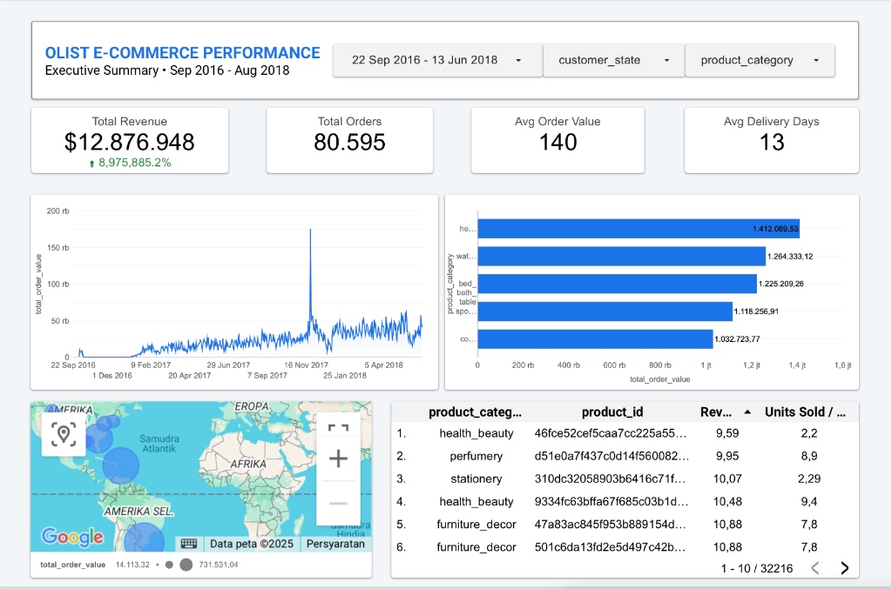
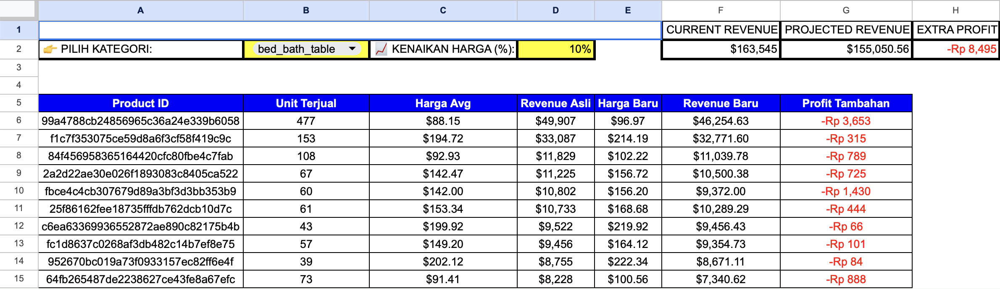

# Olist E-Commerce: Revenue Strategy & Analytics Dashboard

## Executive Summary
Proyek ini adalah simulasi end-to-end data analytics untuk meningkatkan visibilitas performa E-Commerce Olist (Brazil). Fokus utamanya adalah mengubah data mentah menjadi strategi **Pricing** dan **Segmentasi Pelanggan**.

**Key Deliverables:**
1.  **Executive Dashboard:** Monitoring KPI realtime untuk C-Level.
2.  **Pricing Simulator:** Tools interaktif untuk simulasi margin keuntungan.
3.  **SQL Analysis:** Validasi data dan pencarian insight bisnis langsung dari database.

---

## Project Showcase

### 1. Executive Dashboard (Looker Studio)
Dashboard interaktif untuk memantau kesehatan bisnis secara makro (Trends, Revenue, Geolocation).
* **Link Live:** [🔗 Lihat Dashboard Interaktif Disini](https://lookerstudio.google.com/reporting/df473c84-5288-4bd4-99dd-ac9b8a64c536)

*(Dashboard menampilkan Tren Penjualan 2016-2018 dan Distribusi Geografis)*

### 2. Pricing Strategy Simulator (Google Sheets)
Alat bantu keputusan bagi tim Sales. User dapat mengubah variabel "Kenaikan Harga (%)" dan melihat proyeksi revenue baru secara otomatis.
* **Tech:** Dibangun menggunakan `Advanced QUERY()`, `ARRAYFORMULA`, dan Pivot Backend optimization.
* **Link Live:** [🔗 Coba Simulator Disini](https://docs.google.com/spreadsheets/d/1Nxb1N3MzHtU-0iSrrHHYn-y1FsKnQIPXoMgKtb2ZwgM/edit?usp=sharing)

*(Pricing Simulator dengan fitur 'What-If Analysis' untuk menghitung margin)*

### 3. Advanced SQL Logic
Analisis inti dilakukan di Database (PostgreSQL) menggunakan teknik Complex Joins dan Aggregation untuk memvalidasi performa kategori produk.

*(Snippet query SQL yang digunakan untuk mengidentifikasi Top Categories dan Volume Penjualan)*

---

## Key Business Insights
Berdasarkan analisis data historis (Total 96,478 Pesanan):

1.  **Dominasi Regional (42% Market Share):** Negara bagian **Sao Paulo (SP)** adalah kunci logistik utama dengan total **40.501 pesanan** (41,9% dari total nasional). Gangguan pengiriman di area ini akan berdampak fatal bagi revenue perusahaan.
2.  **Winning Product:** Kategori **Health & Beauty** menempati peringkat teratas dalam volume penjualan, menggeser kategori tradisional lainnya. Ini menandakan pergeseran tren konsumen ke produk perawatan diri.
3.  **Opportunity:** Mengingat konsentrasi tinggi di SP, disarankan membangun *Micro-Fulfillment Center* di wilayah tersebut untuk menekan biaya pengiriman dan meningkatkan kecepatan layanan (Same-day delivery potential).

---

## Technical Workflow

1.  **Data Cleaning (Python):** Menggunakan Pandas untuk membersihkan *dirty data* (handling newline characters pada review, standarisasi tanggal).
2.  **Data Warehousing (PostgreSQL):** Desain skema database relasional dan pembuatan Master Table (Denormalized) untuk efisiensi reporting.
3.  **Dashboarding:** Integrasi data master ke Looker Studio dan Google Sheets.

---

**Author:** Fikri Faiz Zulfadhli
*Data Analyst | SQL | Python | Visualization*